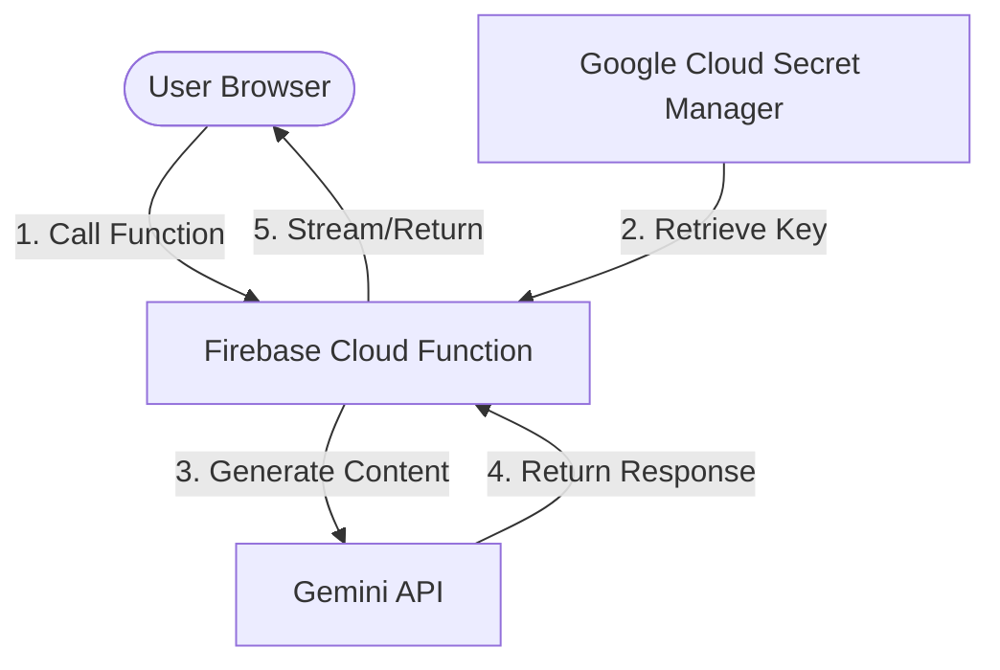

# Gemini API Key Migration & Security Hardening Guide

The current application is a client-side Single Page Application (SPA). To communicate with Gemini, it compiles the `GEMINI_API_KEY` directly into the JavaScript client bundle. 

> [!WARNING]
> **Security Risk**: Embedding API keys in frontend code allows anyone visiting the website to extract the key and use it, incurring billing costs or violating safety usage terms.

To resolve this, we must migrate the key to a backend service like **Firebase Functions** combined with **Google Cloud Secret Manager**.

---

## Architecture Overview



---

## Migration Steps

### Step 1: Set Up Firebase Functions

If you haven't initialized functions in your project, run:
```bash
npx firebase-tools init functions
```
Select **TypeScript** or **JavaScript** (TypeScript is recommended).

### Step 2: Store the Secret in Google Cloud Secret Manager

You can store the Gemini API key securely in Google Cloud Secret Manager. Using the Firebase CLI, you can bind secrets directly to functions:

```bash
npx firebase-tools functions:secrets:set GEMINI_API_KEY="your-api-key-here"
```

This will automatically create a secret named `GEMINI_API_KEY` in Google Cloud Secret Manager for your Firebase project.

### Step 3: Implement the Backend Proxy Function

In your `functions/src/index.ts`, use the Google Gen AI Node.js SDK (`@google/genai`) to handle the chat session. Retrieve the secret directly via function configuration.

```typescript
import { onRequest } from "firebase-functions/v2/https";
import { GoogleGenAI } from "@google/genai";

// Ensure the secret is mounted to the function
export const chatProxy = onRequest({ secrets: ["GEMINI_API_KEY"] }, async (req, res) => {
  // CORS setup
  res.set("Access-Control-Allow-Origin", "*");
  if (req.method === "OPTIONS") {
    res.set("Access-Control-Allow-Methods", "POST");
    res.set("Access-Control-Allow-Headers", "Content-Type");
    res.set("Access-Control-Max-Age", "3600");
    res.status(204).send("");
    return;
  }

  const { messages, systemInstruction, modelName } = req.body;
  const apiKey = process.env.GEMINI_API_KEY;

  if (!apiKey) {
    res.status(500).send("API Key configuration error.");
    return;
  }

  try {
    const ai = new GoogleGenAI({ apiKey });
    const response = await ai.models.generateContent({
      model: modelName || "gemini-3.5-flash",
      contents: messages.map((m: any) => ({
        role: m.role === 'system' ? 'user' : m.role,
        parts: [{ text: m.content }]
      })),
      config: {
        systemInstruction,
      },
    });

    res.status(200).json({ text: response.text });
  } catch (error: any) {
    console.error("Gemini Proxy Error:", error);
    res.status(500).send(error.message || "Internal server error.");
  }
});
```

### Step 4: Update the Frontend Service

Modify `src/services/gemini.ts` to call your new Firebase Cloud Function instead of initializing the SDK on the client side:

```typescript
import { Message } from "../types";

// Replace with your actual Firebase Function endpoint URL
const FUNCTION_URL = "https://<region>-<project-id>.cloudfunctions.net/chatProxy";

export async function chatWithGemini(
  messages: Message[],
  systemInstruction?: string,
  modelName: string = "gemini-3.5-flash"
): Promise<string> {
  try {
    const response = await fetch(FUNCTION_URL, {
      method: "POST",
      headers: {
        "Content-Type": "application/json",
      },
      body: JSON.stringify({
        messages,
        systemInstruction,
        modelName,
      }),
    });

    if (!response.ok) {
      throw new Error(`HTTP error! status: ${response.status}`);
    }

    const data = await response.json();
    return data.text || "";
  } catch (error) {
    console.error("Proxy Service Error:", error);
    return "I encountered an error connecting to the intelligence bridge.";
  }
}
```

### Step 5: Deploy the Backend

Deploy only your backend proxy:
```bash
npx firebase-tools deploy --only functions
```
Once deployed, verify that local and production frontend builds query your Cloud Function proxy without shipping the raw key in the production JavaScript source files.
